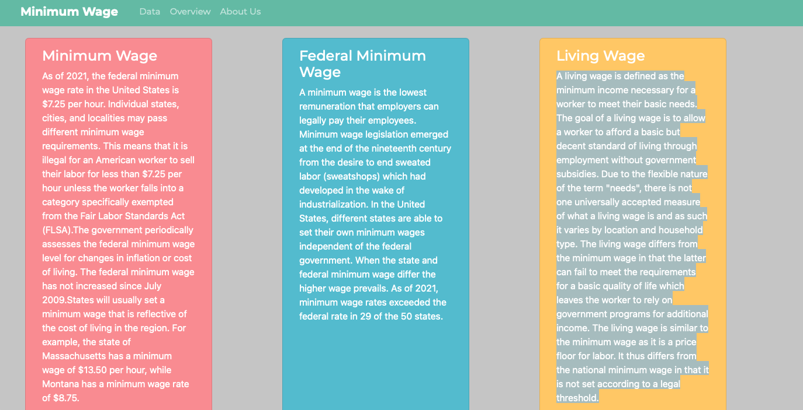
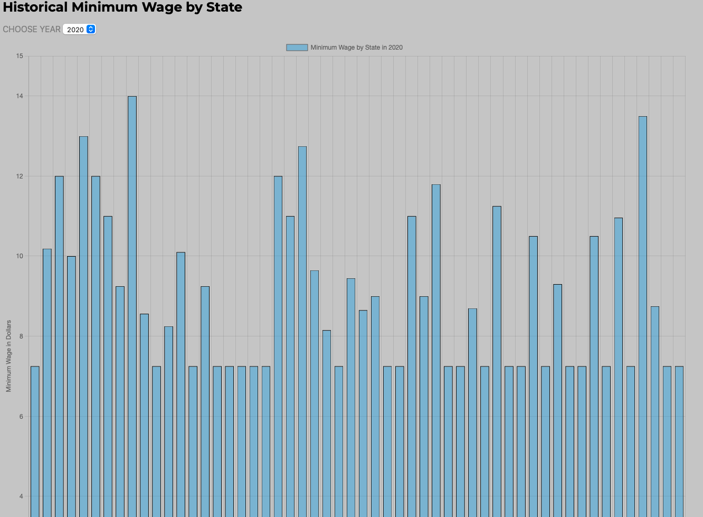
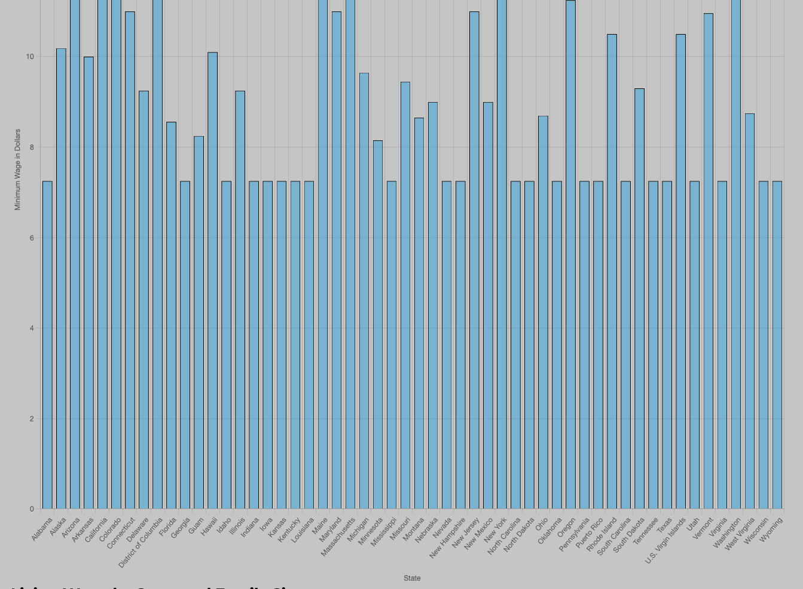
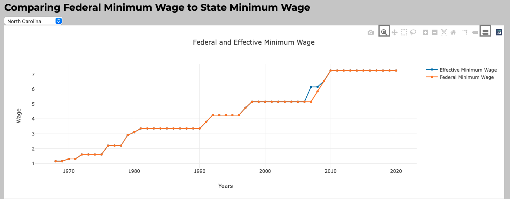
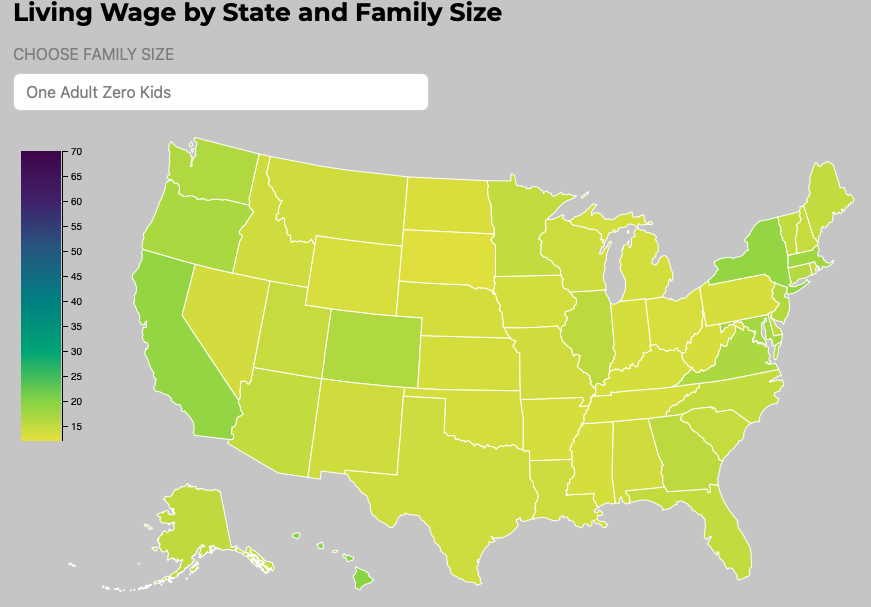

# Minimum-Wage-Project
# Project 2
## Shalyn Lavoie | Lauren McCarthy | Nicole Pierre | Moriah Taylor

## Project description/rationale: 
Visualize minimum wage and federal wage by state and year to see how it compares to the living wage. Ultimately taking a look at if minimum is liveable and/or show how it’s not.

We created a Heroku app to launch our website. We created each HTML page and structured using CSS styling.

  

## Minimum Wage
As of 2021, the federal minimum wage rate in the United States is $7.25 per hour. Individual states, cities, and localities may pass different minimum wage requirements. This means that it is illegal for an American worker to sell their labor for less than $7.25 per hour unless the worker falls into a category specifically exempted from the Fair Labor Standards Act (FLSA).The government periodically assesses the federal minimum wage level for changes in inflation or cost of living. The federal minimum wage has not increased since July 2009.States will usually set a minimum wage that is reflective of the cost of living in the region. For example, the state of Massachusetts has a minimum wage of $13.50 per hour, while Montana has a minimum wage rate of $8.75.

## Federal Minimum Wage
A minimum wage is the lowest remuneration that employers can legally pay their employees. Minimum wage legislation emerged at the end of the nineteenth century from the desire to end sweated labor (sweatshops) which had developed in the wake of industrialization. In the United States, different states are able to set their own minimum wages independent of the federal government. When the state and federal minimum wage differ the higher wage prevails. As of 2021, minimum wage rates exceeded the federal rate in 29 of the 50 states.

## Living Wage
A living wage is defined as the minimum income necessary for a worker to meet their basic needs. The goal of a living wage is to allow a worker to afford a basic but decent standard of living through employment without government subsidies. Due to the flexible nature of the term "needs", there is not one universally accepted measure of what a living wage is and as such it varies by location and household type. The living wage differs from the minimum wage in that the latter can fail to meet the requirements for a basic quality of life which leaves the worker to rely on government programs for additional income. The living wage is similar to the minimum wage as it is a price floor for labor. It thus differs from the national minimum wage in that it is not set according to a legal threshold.

## Data: 
* Minimum Wage: https://www.kaggle.com/lislejoem/us-minimum-wage-by-state-from-1968-to-2017/data
* Living Wage: https://livingwage.mit.edu/

## Github link: https://github.com/shalynalavoie/Minimum-Wage-Project.git

## Heroku APP: https://app-wages.herokuapp.com/

## Visualizations:
* Bar Chart with dropdown that graphs minimum wage by state with the dropdown allowing you to choose the year (using chart.js)

  
  
  
* Line Graph with filter that compares a state’s minimum wage with the federal minimum wage over time with a filter for state (using D3)
  
  
  
* Hexagonal Map with filter - map of the United States with the states colored by living wage with a filter that categorizes by family (ex: 1 adult 0 kids, or 2 adults 2 kids) with a tool tip that comes up whenever you hover over the state (using highcharts)

  
